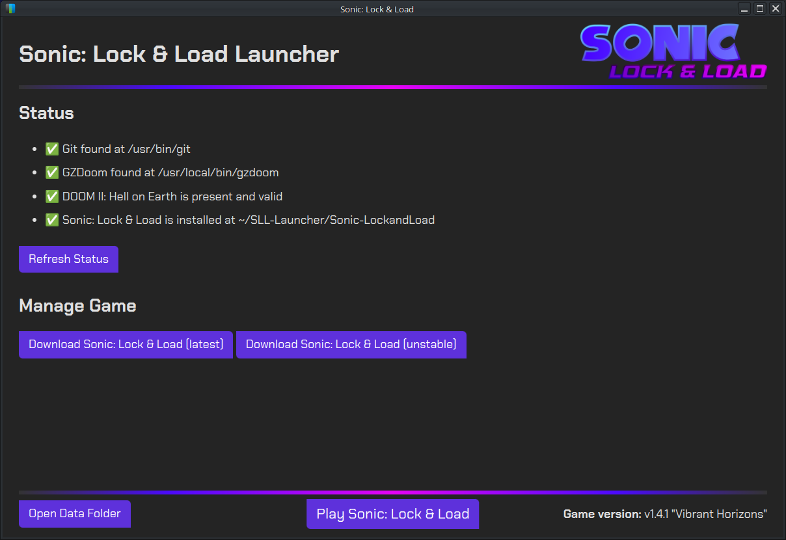

# Sonic: Lock & Load Launcher (`tauri` branch)

> [!CAUTION]
> Sonic: Lock & Load Launcher is in the middle of being rewritten to use
> [Tauri](https://tauri.app/). For the old Electron-based launcher, see
> the [main branch](https://github.com/Sonic-LockandLoad/SLL-Launcher/tree/main).

This is a Tauri-based launcher for [Sonic: Lock & Load](https://sonic-lockandload.github.io).

This launcher is designed to facilitate easy installation of the game, the
GZDoom engine, the DOOM II IWAD, user configuration, etc.

## Tauri Migration Checklist

+ [X] Create a Tauri app
+ [X] Move the old Electron-based launcher to an `old/` directory
+ [ ] Rewrite the features of `old/src/main.ts` into `/src-tauri/src/main.rs`
+ [ ] Port the `old/src/renderer.ts` to `/src/main.ts`
+ [ ] Move `old/src/index.html`, `old/src/style.css`, `old/src/fonts.css` and `old/src/fonts/` to `/src-tauri/`

## Features

+ Play Sonic: Lock & Load without the hassle of setting up DOOM II
+ See your Git, GZDoom, DOOM II IWAD and Sonic: Lock & Load status
+ Download Freedoom: Phase 2 using the standard browser download dialog
+ Download Sonic: Lock & Load directly, either through GitHub Releases (latest)
or `git clone` (unstable).
+ Cross-platform support (Windows, macOS, Linux)

## Future Additions

+ Allow the user to change their Sonic: Lock & Load version
+ Supply default configurations for specific use cases

## Licence

This project is licensed under the GNU General Public License, either version 3
or any later version.
